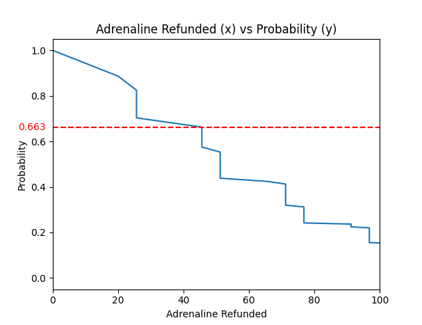

# fsoa-adren
Python script used to determine the probabilities associated with refunding X amount of adrenaline during the Fractured Staff of Armadyl (FSOA) spec.
Also asks the user to confirm whether certain buffs (Tsunami, Natural Instinct, Ring of Vigour, Invigorating) are present or not.
In the end, it returns the adrenaline vs probability plot, and shows what the chance of refunding the specified amount of adrenaline is.

## Example plot - chance of returning 45% adrenaline from a 5-hit ABS with all buffs active

As shown above, there is a 66.3% chance of refunding 45% adrenaline with the conditions stated.
